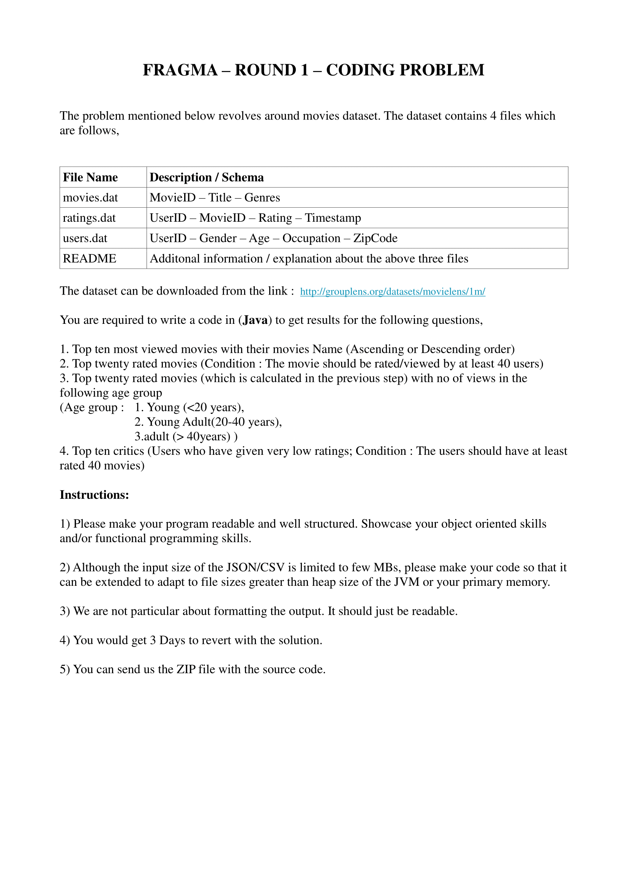

# FragmaData_2017_Assignment_Movies

---------------------
Assignment : 
---------------------

<B>The dataset can be downloaded from the link :</B>
https://grouplens.org/datasets/movielens/1m/
----------------------------------------------
Complexity analysis : 
----------------------------------------------
The time and space complexity is O(n) for all operations ... where n is the largest number in the given categories .
All hashmap entry/lookup operations are performed in amortized constant time operations and all the objects are in memory while the program is running .

-----------------------------------------------

Description of the datasets can be found in the <B>project wiki</B>
